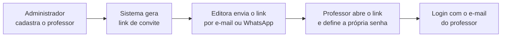

# Visão do produto

**Cliente:** Diego — Colli Books Editora (Águas Claras, Brasília/DF)
**Produto:** Plataforma de consulta ao acervo por disciplina, voltada a professores
**Versão:** 3.0 — acesso controlado pela editora por convite

---

## O problema a resolver

O sistema resolve um problema único: **um professor precisa descobrir quais obras do acervo servem à disciplina que leciona.** A editora cadastra o professor, ele recebe um convite, define sua senha, busca por disciplina (ex.: Matemática) e encontra as obras daquela área com o material pedagógico correspondente.

Os dois únicos perfis são:

- **Professor** — consome o acervo. Busca, consulta e baixa material.
- **Administrador** — alimenta o acervo e controla quem tem acesso.

Não há área de cliente final, carrinho, orçamento ou venda dentro do sistema. A venda continua na loja oficial existente.

---

## Decisão de acesso

!!! warning "Não existe auto-cadastro"
    Só entra no sistema quem a editora cadastrar — é isso que impede a plataforma de virar uma base indistinta de quem é ou não professor.

### Fluxo de convite

Esse desenho existe por dois motivos:

1. **Nenhuma senha trafega por mensagem** e fica registrada para sempre numa conversa de WhatsApp.
2. **O link de convite e a recuperação de senha usam o mesmo mecanismo de token** — uma implementação atende as duas estórias, o que reduz o esforço em vez de aumentá-lo.

---

## Decisão técnica central

A relação entre obra e disciplina é **muitos-para-muitos**: uma obra de literatura infantil pode atender Português, História e Ensino Religioso ao mesmo tempo. E a lista de disciplinas **não é fixa no código** — a editora cria e ajusta conforme o acervo cresce.

!!! tip "Por que US15 e US16 são `MUST`"
    Sem a gestão de disciplinas e o vínculo obra–disciplina, a busca da [US06](../backlog/epico-2-busca.md#us06-busca-por-disciplina-must-5-pts) não tem o que retornar.
