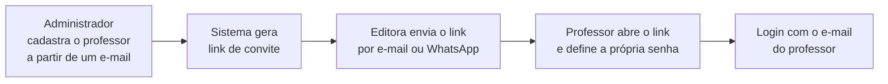

# Visão do produto

**Cliente:** Diego — Colli Books Editora (Águas Claras, Brasília/DF)
**Produto:** Plataforma de consulta ao acervo por tema e escolaridade, voltada a professores
**Versão:** 3.0 — acesso controlado pela editora por convite

---

## O problema a resolver

O sistema resolve um problema único: **um professor precisa descobrir quais obras do acervo contém o tema que procura.** A editora cadastra o professor a partir de um e-mail, ele recebe um convite, define sua senha, busca obras pelo nome, filtra por tema e escolaridade, e encontra as obras daquela área — com um link direto para compra na loja oficial.

Os dois únicos perfis são:

- **Professor** — consome o acervo. Busca, filtra, consulta, seleciona e salva obras.
- **Administrador** — alimenta o acervo, cria temas e escolaridades, vincula-os aos livros e controla quem tem acesso.

Não há área de cliente final, carrinho, orçamento ou venda dentro do sistema. A venda continua na loja oficial existente.

---

## Decisão de acesso

!!! warning "Não existe auto-cadastro"
    Só entra no sistema quem a editora cadastrar — é isso que impede a plataforma de virar uma base indistinta de quem é ou não professor.

### Fluxo de convite

Esse desenho existe por dois motivos:

1. **Nenhuma senha trafega por mensagem** e fica registrada para sempre numa conversa de WhatsApp.
2. **O link de convite e a recuperação de senha usam o mesmo mecanismo de token** — uma implementação atende as duas estórias.

