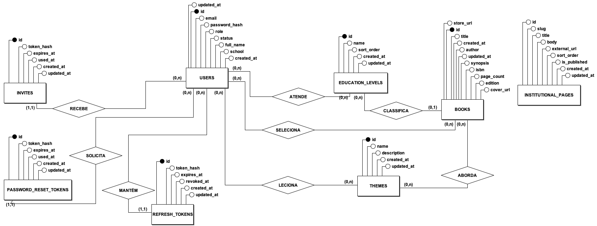
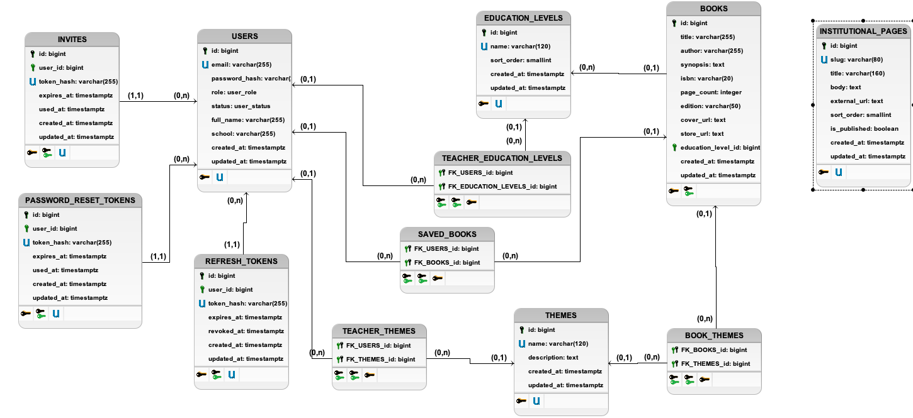

# Modelo físico do banco de dados

Neste projeto optamos pelo **PostgreSQL 16**, com **Alembic** para versionar as
migrations. Os models ficam em `app/models/` do repositório
[`colli-books-backend`](https://github.com/Colli-Books/colli-books-backend), escritos
com SQLAlchemy 2.0.

---

## Modelo conceitual (DE-R)

Oito entidades e oito relacionamentos, com as cardinalidades em notação min-max.

## Modelo lógico (DLD)

Os quatro relacionamentos N:N viraram tabelas de associação. Os 1:N viraram coluna de
chave estrangeira.

`INSTITUTIONAL_PAGES` não se relaciona com as demais.

---

## Tabelas

| Tabela | Para que serve | Estórias |
| --- | --- | --- |
| `users` | Contas de professor e administrador, diferenciadas por `role` | US01, US03, US05, US10 |
| `invites` | Tokens de convite de primeiro acesso (uso único) | US01, US02 |
| `password_reset_tokens` | Tokens de "Esqueci minha senha" (uso único) | US04, US06 |
| `refresh_tokens` | Refresh tokens revogáveis, para o logout encerrar a sessão | US03 |
| `books` | Obras do acervo | US09, US15 |
| `themes` | Temas cadastrados pela editora | US16 |
| `education_levels` | Escolaridades cadastradas pela editora | US16 |
| `book_themes` | Vínculo obra ↔ temas (N:N) | US17 |
| `teacher_themes` | Temas que o professor leciona (N:N) | US11 |
| `teacher_education_levels` | Escolaridades que o professor atende (N:N) | US11 |
| `saved_books` | "Minha Seleção" do professor (N:N) | US12 |
| `institutional_pages` | Seções institucionais do menu lateral | US18 |

---

## Relacionamentos

Cardinalidades em min-max, na ponta de cada entidade. Não há relacionamento 1:1.

### 1:N

| Nome | | | Coluna FK |
| --- | --- | --- | --- |
| recebe | `users` **(0,n)** | `invites` **(1,1)** | `invites.user_id` |
| solicita | `users` **(0,n)** | `password_reset_tokens` **(1,1)** | `password_reset_tokens.user_id` |
| mantém | `users` **(0,n)** | `refresh_tokens` **(1,1)** | `refresh_tokens.user_id` |
| classifica | `education_levels` **(0,n)** | `books` **(0,1)** | `books.education_level_id` |

`books.education_level_id` aceita nulo, por isso `(0,1)`: uma obra pode ficar sem
escolaridade (US17).

### N:N

Cada uma virou tabela de associação, com chave primária composta pelas duas chaves
estrangeiras.

| Nome | | | Tabela |
| --- | --- | --- | --- |
| aborda | `books` **(0,n)** | `themes` **(0,n)** | `book_themes` |
| leciona | `users` **(0,n)** | `themes` **(0,n)** | `teacher_themes` |
| atende | `users` **(0,n)** | `education_levels` **(0,n)** | `teacher_education_levels` |
| seleciona | `users` **(0,n)** | `books` **(0,n)** | `saved_books` |
